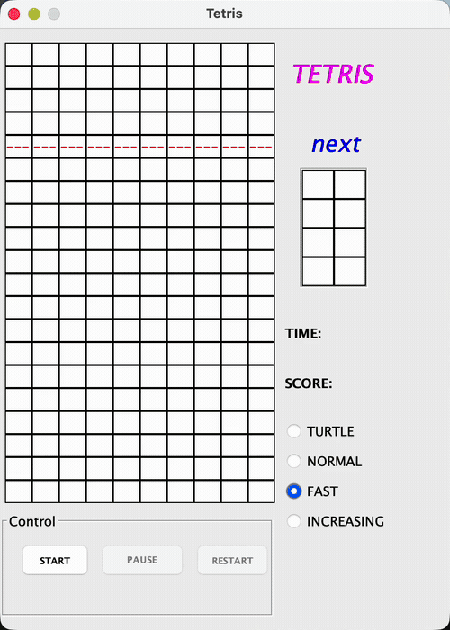
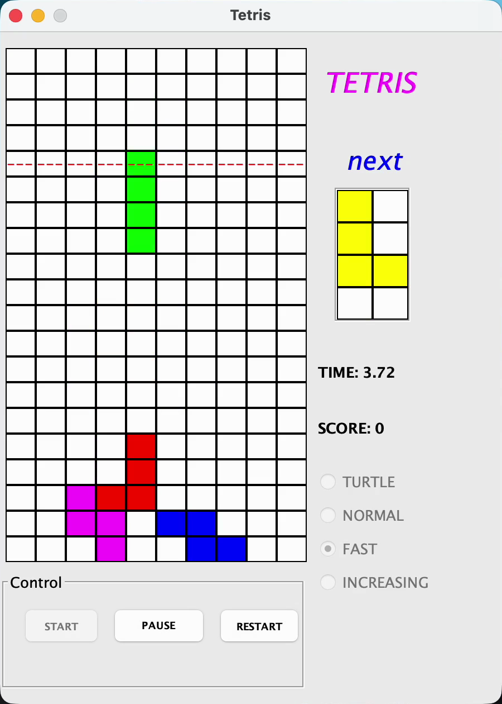

# Tetris

一个完整的 Java 桌面俄罗斯方块，包含方块下落、移动、旋转、消行、计分、计时、难度与下一个方块预览。

[English](README.md)

## 项目概述

项目在网格中建模俄罗斯方块的生成与变换，检查移动和旋转是否与边界或已落地方块冲突，清除完整行，并协调分数、计时、暂停、重启和难度状态。

## 演示



[查看高清 MP4 演示](assets/visual-demos/tetris-falling-blocks.mp4)

视频直接录制自原生 Swing 应用，展示速度选择、开始、移动、旋转、加速下落、下一个方块预览、暂停、重启、计时和结束状态。

## 截图



## 功能

- 方块自动下落与左右/向下移动
- 旋转与碰撞检查
- 完整行清除
- 分数和用时反馈
- 难度选择
- 暂停、重启与下一个方块预览

## 操作

- 移动：方向键左右或 A/D
- 加速下落：方向键下或 S
- 旋转：方向键上或 W

## 运行

仓库中的 JAR 已在 Java 25 上验证：

```bash
java -jar Tetris.jar
```

## 当前限制

项目暂未提供确定性方块随机种子或自动化游戏测试。
